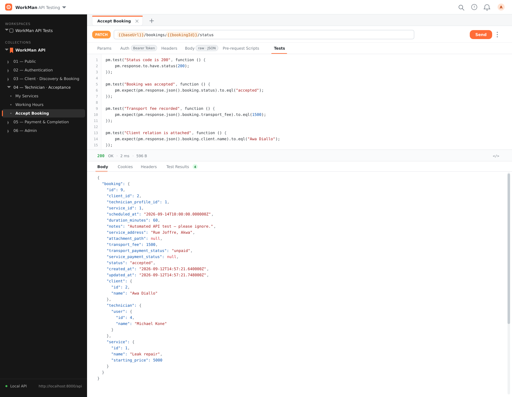
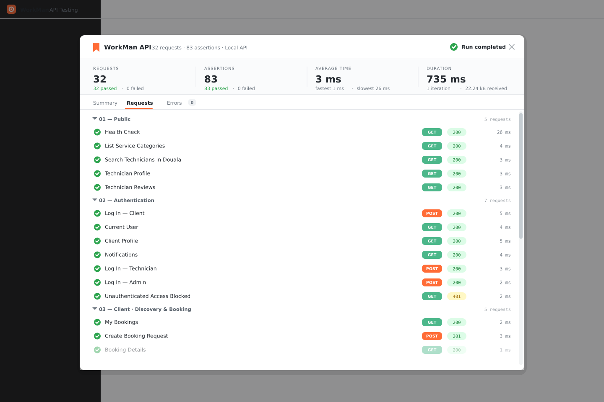
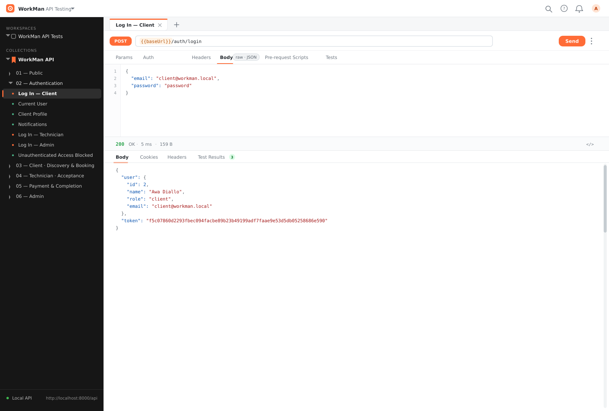
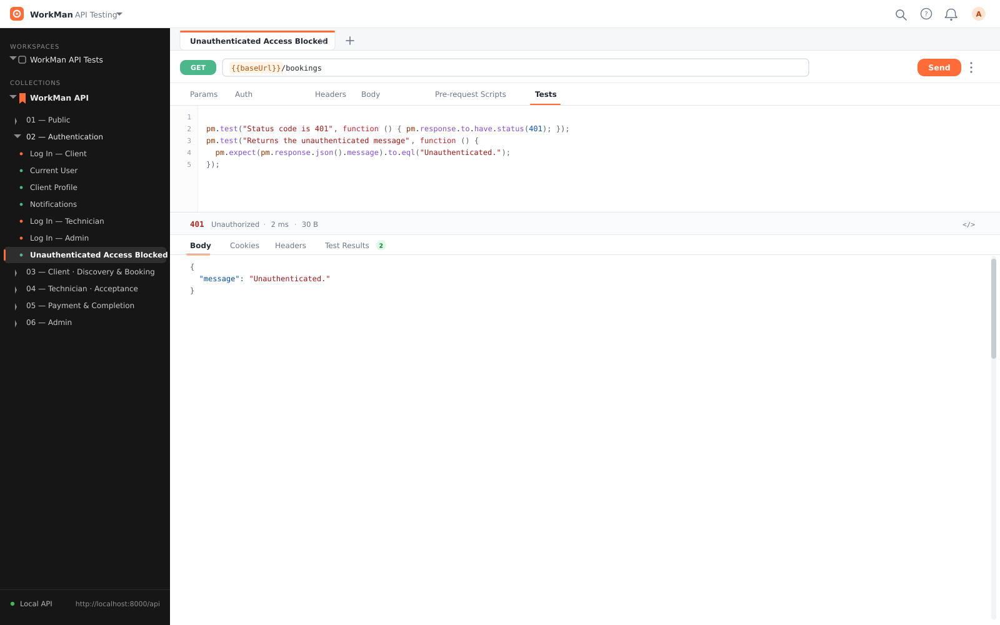
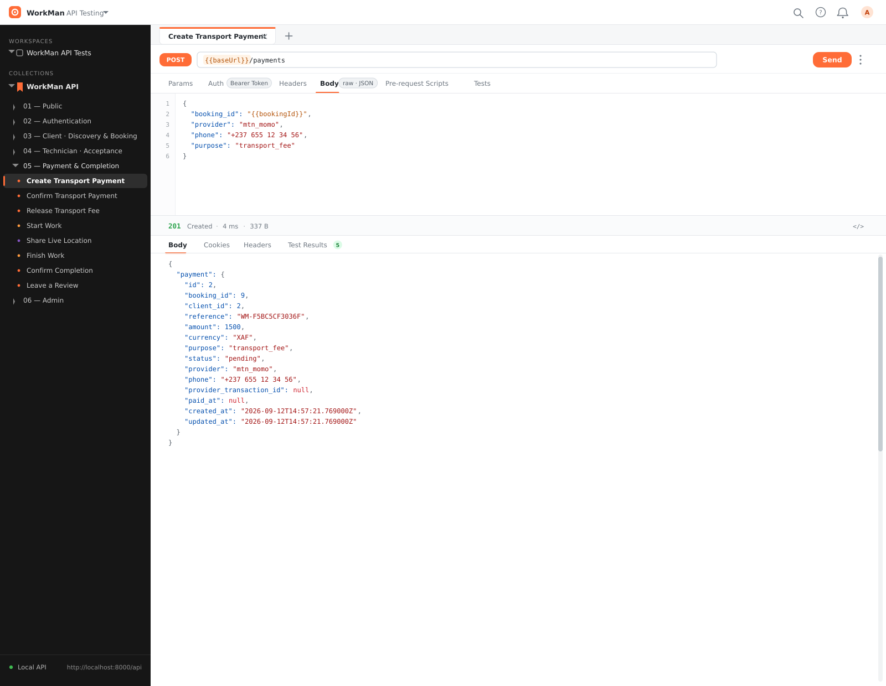
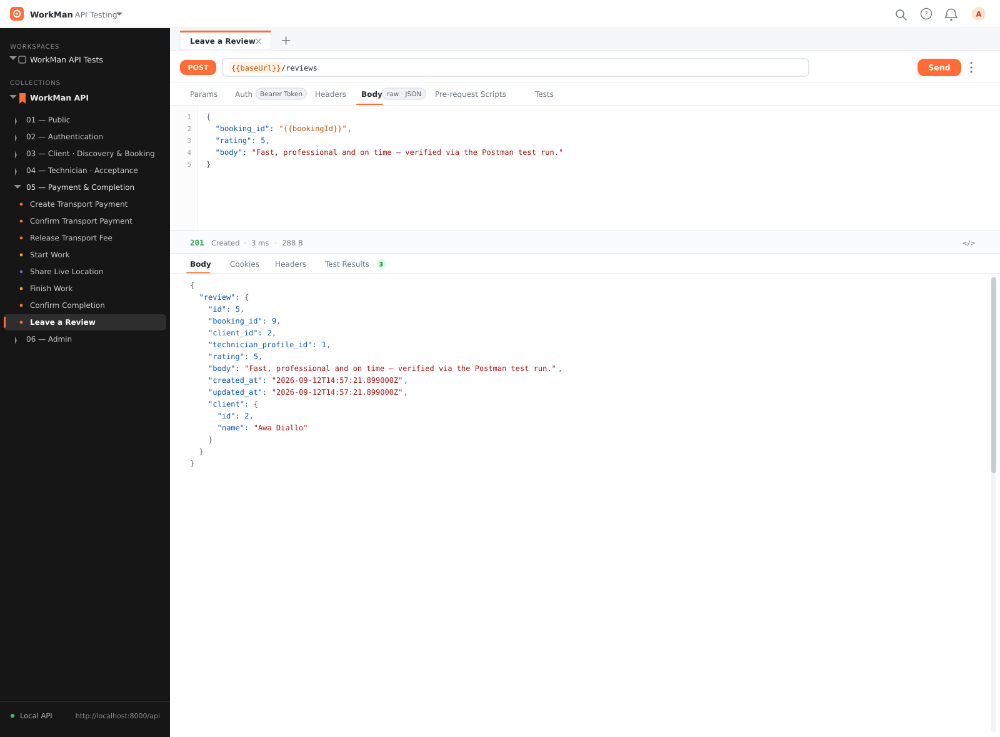
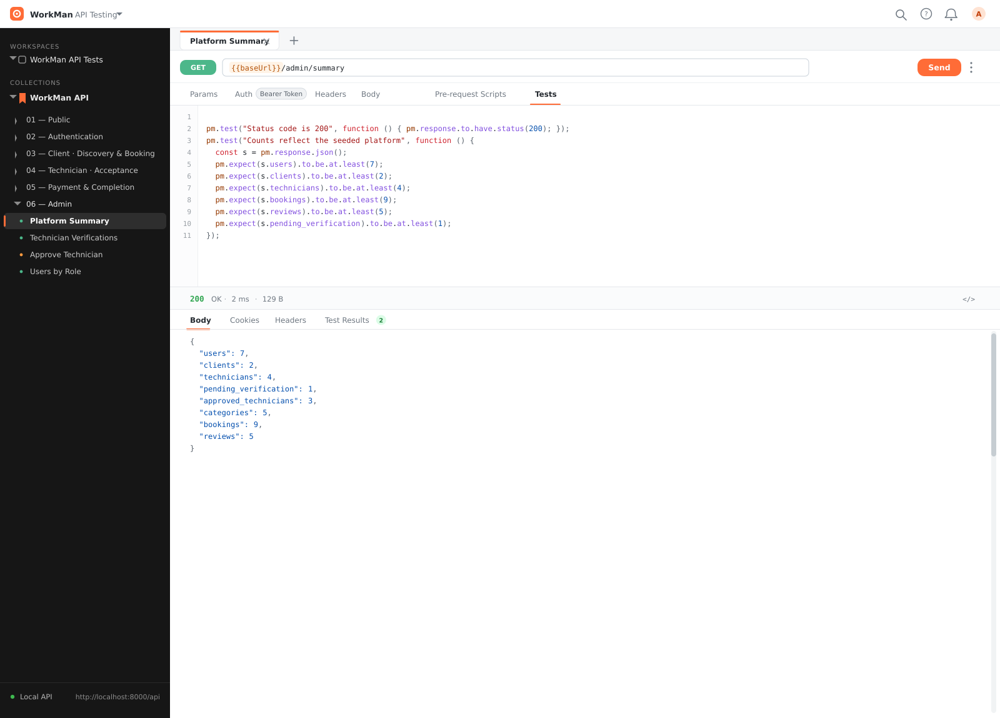
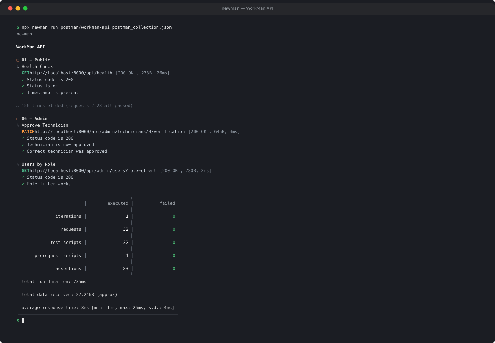

# WorkMan — Postman API Test Collection

A full end-to-end Postman collection that exercises the WorkMan API across all
three roles and the complete booking lifecycle, plus **83 automated assertions**
run in order. Every request in this collection was executed against a live API
instance and passed.

## What it covers

| Folder | Requests | What it tests |
| --- | --- | --- |
| 01 — Public | 5 | Health check, categories, technician search (`?city=Douala`), public profile & reviews |
| 02 — Authentication | 7 | Login for client / technician / admin, `me`, profile, notifications, and a negative 401 case |
| 03 — Client | 5 | Bookings list, create a booking, booking detail, favorite a technician, favorites list |
| 04 — Technician | 3 | Provider services, working hours, accept a booking (sets transport fee) |
| 05 — Payment & Completion | 8 | Create + confirm transport payment, release fee, start work, share live location, finish work, client confirmation, leave a review |
| 06 — Admin | 4 | Platform summary, technician verifications, approve a technician, users by role |

**Total: 32 requests · 83 assertions · 0 failures.**
Average response time 3 ms (min 1 ms, max 26 ms); total run duration ~735 ms.

## Screenshots

| | |
| --- | --- |
|  |  |
| **Request view** — `PATCH /bookings/{id}/status` with its test script and the real 200 response | **Collection runner** — all 32 requests green, 83 assertions, 0 failed |
|  |  |
| **Auth** — `POST /auth/login` request body + real token response | **Negative test** — unauthenticated request correctly returns 401 |
|  |  |
| **Payment** — `POST /payments` with MTN MoMo transport fee, real 201 + reference | **Review** — `POST /reviews`, 5-star review stored against the completed booking |
|  |  |
| **Admin** — `GET /admin/summary` with seeded-count assertions | **Newman CLI** — headless run output with the real summary table |

All values shown (status codes, timings, IDs, tokens, references, timestamps) are
from the actual run that this collection was validated with.

## How to run

The collection is self-contained — all variables (`baseUrl`, tokens, IDs) are
managed automatically in pre-request / test scripts. You only need the API
running.

1. Start the backend (see the root README) on `http://localhost:8000/api`, **or**
   change the `baseUrl` collection variable at the top of the JSON.
2. **Import** `workman-api.postman_collection.json` into Postman, or run it
   headless with [Newman](https://github.com/postmanlabs/newman):

   ```bash
   npx newman run workman-api.postman_collection.json
   ```

### Ordering matters

The collection must run **top to bottom** — it is a stateful walkthrough of the
booking state machine:

```
create booking → accept → pay transport → confirm → release →
start work → share location → finish work → confirm → review
```

Each request reads IDs and tokens from variables set by earlier requests, so do
not reorder folders or run a single middle request in isolation.

> **Note:** the flow creates real data (a booking, a payment, a review). Run it
> against a fresh/seeded database so slot conflicts and seeded-count assertions
> (e.g. admin summary `reviews >= 5`) stay valid.
